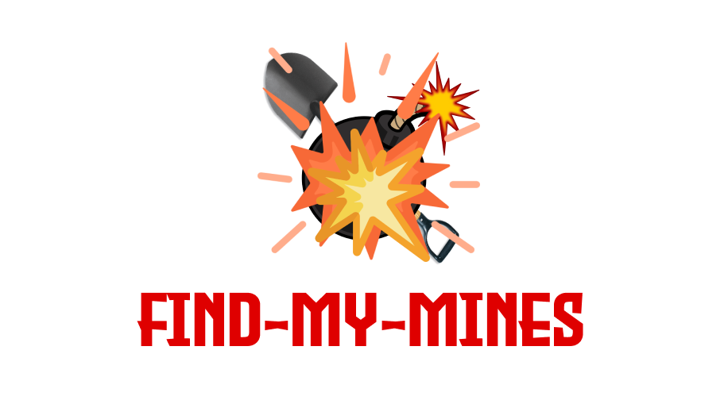

# Find My Mines



## Getting start
available: https://find-my-mines.herokuapp.com/


- all instructions are available at how-to-play page
- Implement using NextJS with custom server for the purpose of routing and host both client and server within this repo
- front-end: React with css module
- back-end: nodeJS with Socket.io

## For Admin

available: https://find-my-mines.herokuapp.com/admin

available: https://admin.socket.io/ (url: https://find-my-mines.herokuapp.com/admin)

**Credential**

-username: admin

-password: admin 

## Developed by Group16
- Sopon Kongnithigarn 6238228621
- Chotipat Chaiyarat 6238046721
- Wirit Khongcharoen 6238200021
- Krittin Punpermcharoenkit 6238008921
- Yongyutha Kunapinun 6031835521

(for the purpose of Netcentric course)

## For development
Clone the project:

```bash
git clone https://github.com/soponkntg/find-my-mines
```

First, install all dependencies:

```bash
npm install
# or
yarn install
```

Then, run the development server:

```bash
npm run dev
# or
yarn dev
```

Open [http://localhost:3000](http://localhost:3000) with your browser to see the result.


